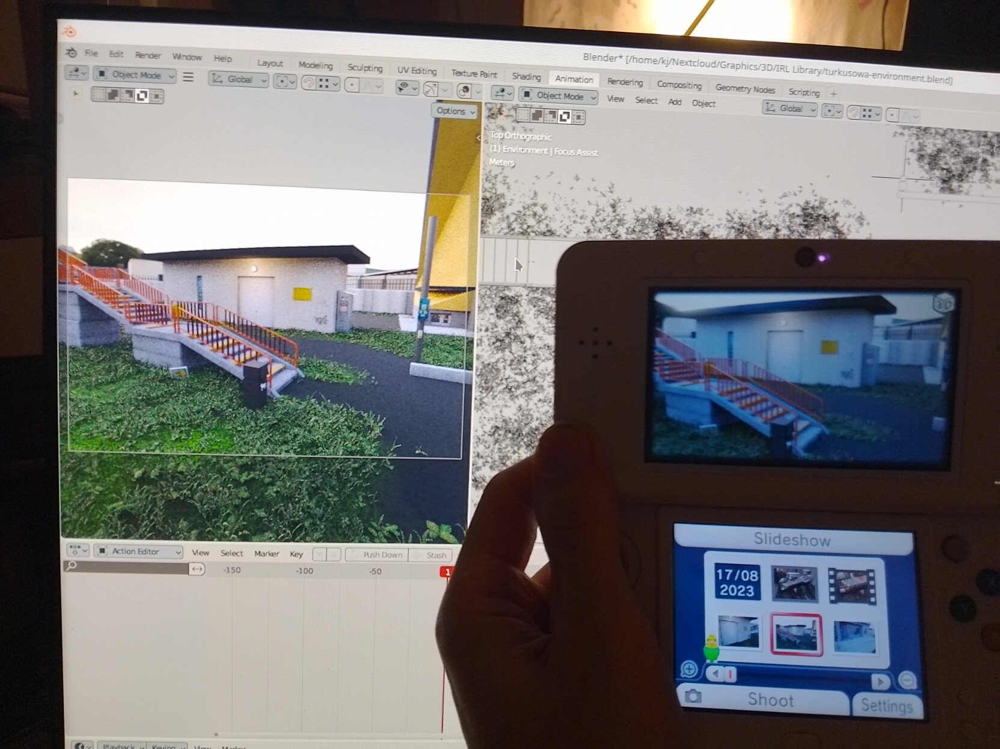

# render-to-3ds-mpo
Blender plugin for easy rendering MPO files for Nintendo 3Ds stereoscopic display.

Watch your blender scenes in real holographic-like experience!

## How to Use

* Install Add-on
* Setup two cameras: Camera_Left, Camera_Right
* Set default path in Output tab (no filename)
* Go to Render tab and scroll down to Render MPO
* Click button and wait...
* For now combine images using [StereoPhoto Maker Pro](https://stereo.jpn.org/eng/stphmkr/)
* I put my .mpo files on server and download them using browser on my 3Ds
